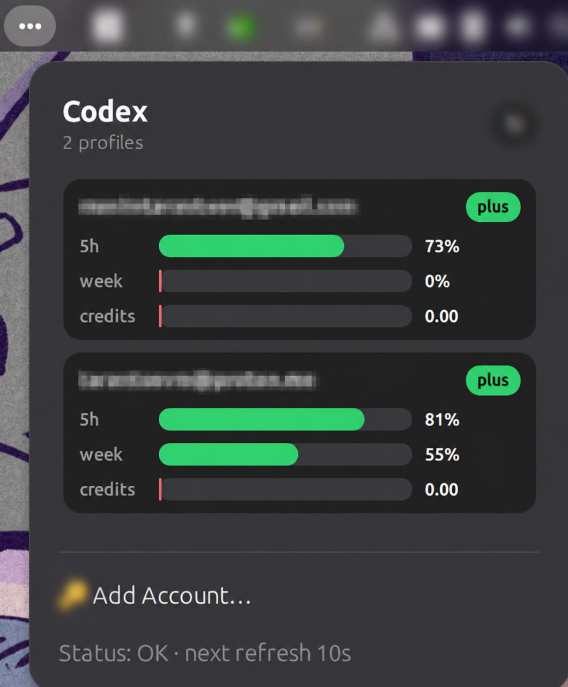

# CBL — Codex Bar for Linux

CBL is a small Linux desktop app that shows your ChatGPT/Codex usage limits in the GNOME top bar.
It supports multiple accounts, shows 5-hour / weekly / credits usage, and lets you add accounts from the popup without using the terminal.

[Русская версия](README.ru.md)



## Why use it?

CBL answers one simple question: **how much Codex usage do I have left right now?**

It gives you:

- a compact GNOME top-bar indicator;
- a popup with one card per account;
- account email/name labels when available;
- 5h, weekly, and credits progress bars;
- manual refresh with spam protection;
- automatic refresh every minute;
- a built-in device-code login flow;
- a local HTTP API for panels and custom integrations.

CBL does **not** require Codex CLI. It stores its own login data in `~/.config/cbl`.

## Quick links

### Install / update on Ubuntu GNOME

```bash
curl -fsSL https://raw.githubusercontent.com/hermes-at/cbl/main/install.sh | bash -s -- --proxy socks5h://127.0.0.1:2080 --systemd --extension
```

Without a proxy:

```bash
curl -fsSL https://raw.githubusercontent.com/hermes-at/cbl/main/install.sh | bash -s -- --systemd --extension
```

After install, if needed:

```bash
systemctl --user restart cbl.service
gnome-extensions enable cbl@codex-limits
gnome-extensions info cbl@codex-limits
```

On GNOME Wayland, log out of your Linux user session and log back in after installing or updating CBL. GNOME Shell can keep old extension code in memory until the user session is restarted.

Expected state:

```text
State: ACTIVE
```

### Full uninstall

This removes the user service, binaries, tray autostart, GNOME extension, and `~/.config/cbl` account/config files.

```bash
curl -fsSL https://raw.githubusercontent.com/hermes-at/cbl/main/uninstall.sh | bash
```

## How to add an account

1. Install CBL with the command above.
2. Log out of your Linux user session and log back in, especially on GNOME Wayland.
3. Open the GNOME top-bar indicator: `•••`.
4. Click **Add Account…**.
5. CBL opens the OpenAI device confirmation page in your browser.
6. The popup shows a one-time **Code**.
7. Click the **Code** row to copy it, then paste it in the browser.
8. After confirming in the browser, click **I confirmed login** in the popup.
9. CBL refreshes immediately and the account card appears.

You can repeat this flow to add more accounts. Each account gets its own card.

## How to use it

- Open the top-bar `•••` indicator to see all account cards.
- The `5h` row shows the remaining short usage window.
- The `week` row shows the remaining weekly usage window.
- The `credits` row shows available credits when the account reports them.
- Click the refresh button in the popup header to refresh manually.
- Manual refresh is throttled so repeated clicks do not spam requests.
- The status line shows when the next automatic refresh will happen.

## Local commands

```bash
cbl status
cbl status --json
cbl status --waybar
cbl serve --addr 127.0.0.1:18088
```

If you need a proxy for local commands:

```bash
CBL_PROXY=socks5h://127.0.0.1:2080 cbl status
```

## Local HTTP API

When the user service is running, CBL exposes:

```bash
curl http://127.0.0.1:18088/api/status
curl http://127.0.0.1:18088/waybar
```

The GNOME extension reads this local API.

## Build from source

Requirements:

- Go 1.22+;
- `bash`, `curl`, `tar`, `python3`;
- GNOME Shell + `gnome-extensions` for the GNOME popup;
- optional: `libayatana-appindicator3-dev` for the tray fallback.

Clone and build:

```bash
git clone https://github.com/hermes-at/cbl.git
cd cbl
go test ./...
go build -o cbl ./cmd/cbl
go build -o cbl-tray ./cmd/cbl-tray
```

Install from a checkout:

```bash
./install.sh --systemd --extension
```

Package release artifacts:

```bash
VERSION=v0.0.0-dev ./release/package-release.sh
```

Package only the GNOME extension zip:

```bash
./install/ubuntu/package-gnome-extension.sh
```

## Config and files

CBL uses per-user files only:

- `~/.local/bin/cbl`
- `~/.local/bin/cbl-tray`
- `~/.config/systemd/user/cbl.service`
- `~/.config/cbl/config.json`
- `~/.config/cbl/accounts/*.json`
- `~/.local/share/gnome-shell/extensions/cbl@codex-limits`

Environment variables:

- `CBL_PROXY` — HTTP/SOCKS proxy for login/status/serve;
- `CBL_AUTH_FILE` — override legacy single-account auth path;
- `CBL_CONFIG_FILE` — override config path;
- `CBL_BASE_URL` — override ChatGPT base URL;
- `CBL_FIXTURE` — offline JSON fixture for tests/development.

## Notes

- CBL is intentionally focused on Codex usage visibility.
- The default Ubuntu/GNOME path is systemd user service + GNOME Shell extension.
- Non-GNOME desktops can use the AppIndicator tray fallback or the local HTTP/Waybar output.
